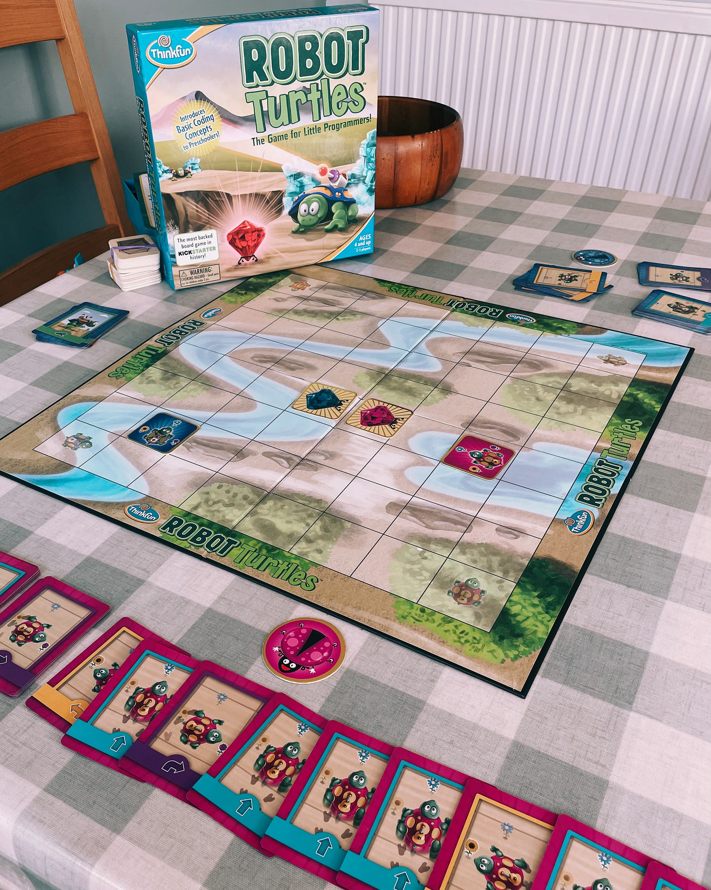
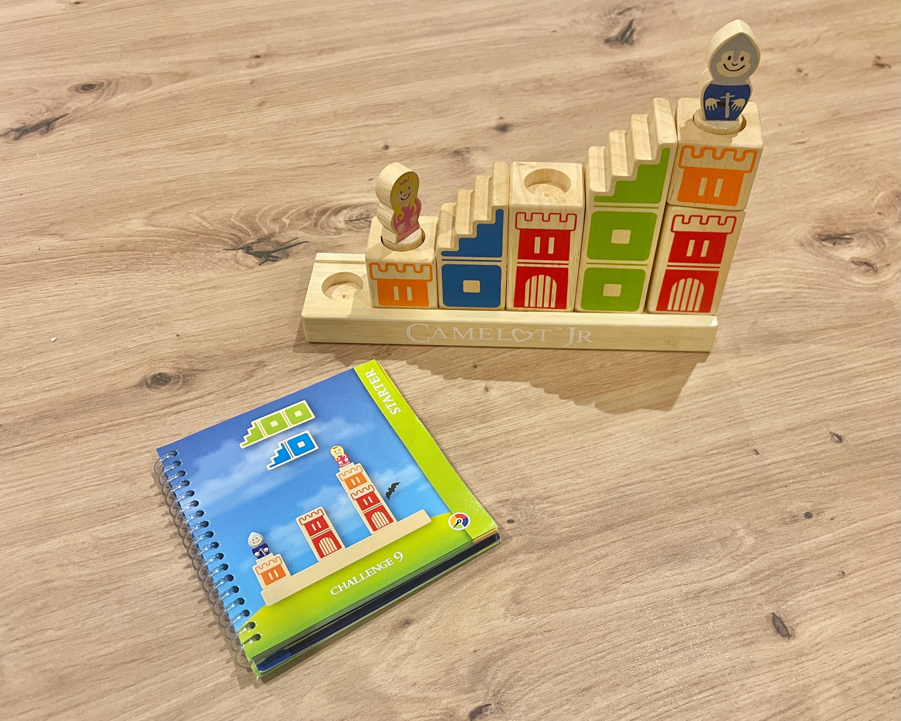
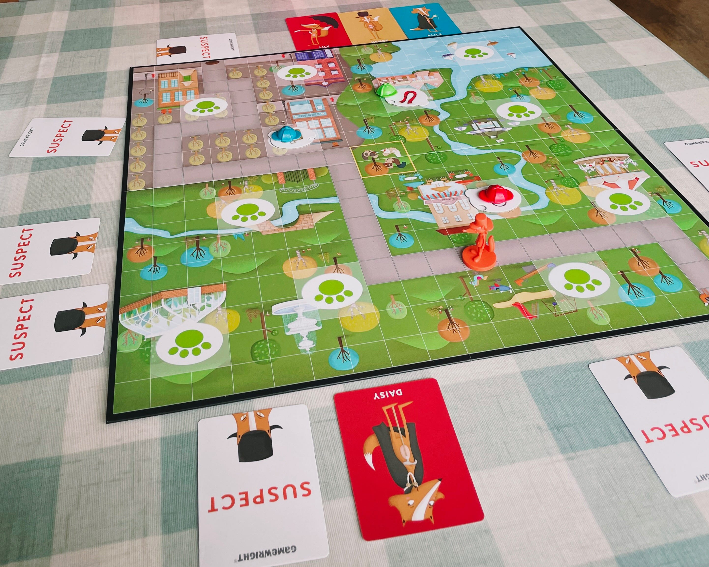
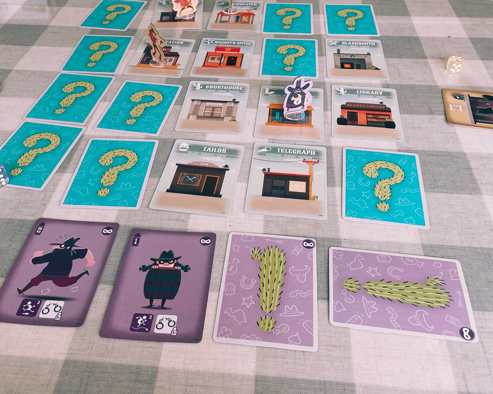

Board games can be a great way to introduce coding concepts to kids, as well as teaching them problem solving skills they can apply in STEM subjects and beyond.

In this post I’ll share five games which we’ve enjoyed in our family.  Some of these teach coding directly, with kids ‘programming’ their turns. Others help with more general reasoning and problem solving.

## Robot Turtles
Ages 4+ | 1 adult & 1-4 kids | Published by [Think Fun](https://www.thinkfun.com/)

In this game, kids take turns playing cards to guide their turtle across the board to a jewel.  Your role is to act as the computer - following the instructions on the cards to move the turtles.  

As this game is aimed at younger children, it starts out simply with them playing one card at a time.  These cards control how you will move their turtle, but often the result won’t be what they intended (such as turning left when they meant to turn right).  When this happens they can shout ‘BUG!’ and have another go, trying different cards until they get the turtle to do what they wanted.  

This is a great way to teach that computers will do **exactly** what you tell them to do, even if that’s not what you meant!

Once the kids have got the hang of playing one instruction at a time, you can level up to an advanced mode where they must play a sequence of cards to get to the jewel in one go - effectively writing a program to solve the level.  It’s again up to you to execute this program to see where the turtle ends up.  They can still shout ‘BUG!’ if something goes wrong, but will have to start again from scratch when they rerun the program.

The game also has one even more complex level, where children are introduced to the programming concept of functions - a set of instructions which can be reused many times within a program.

At this level the challenge is to get to the jewel using the minimum number of cards.  To do this they’ll have to recognise the repeating patterns in their code, and extract these into a function to make the program as short as possible.

Robot Turtles has a great learning curve, starting very simply but then gradually introducing new coding concepts and obstacles to overcome.  It’s also good for kids who don’t like things to be too competitive - everyone can win if they play the right instructions.

## Camelot JR
Ages 4+ | 1 Player | Published by [Smart Games](https://www.smartgames.eu/)

Camelot Jr. is a puzzle game, where the objective is to arrange a set of wooden blocks in the correct way to allow the princess and knight to reach each other.  It’s a fantastic game for building problem solving skills, and developing spatial thinking. 

While it’s designed to be played solo, it also works well as a team game, with the kids collaborating to solve the problems.  You can set up a problem for the child and let them try to work out the answer.

The game comes with a book of 50 puzzle setups, which cover four difficulty levels.  These range from easy up to the master level which will be challenging for adults as well.

The easy puzzles do a good job of getting the kids familiar with what they need to do, but more persistence is needed as the difficulty increases.  Often the problems can be solved logical deduction - if one of the blocks can only go in one particular place, what positions are left for the other blocks?

My daughter picked this up at age 5, and enjoyed working through the easy and medium difficulty levels.  She came back to tackle the harder challenges when she was a bit older, but while she was working up to that she also got a lot of enjoyment out of playing with the wooden blocks and figures.

Once a child has mastered the game and finished the 50 problems included, replay value isn’t great. But, if your kid has memorised all the solutions they could always have a go at making up their own puzzles.

## Outfoxed
Ages 5+ | 2-4 Players | Published by [Gamewright](https://gamewright.com/)

This game requires children to use their logic and deduction skills to solve the case of a stolen pie.  We know that the guilty party is a fox, but to work out exactly who did it the players will have to navigate the board, revealing suspects and finding clues as they go, and hoping that they will reach a conclusion before the culprit escapes with the goods.  

The recommended age of 5 seems accurate for this one.  We got this for my daughter at that age and she got the hang of it quickly. - it’s now a firm favourite in our house. 

The core of the game involved finding clues - items which the guilty fox is or isn’t wearing.  These must then be compared against the suspect cards, a number of nicely illustrated foxes all sporting different combinations of items.  The kids must use the clues to eliminate the suspects, until only one remains.

As well as teaching logic and deduction skills, the kids will also need to work as a team to plan out their actions.  To play most effectively they’ll need to divide up the tasks of finding clues vs. revealing suspects, and ensure they spread out across the board so they don’t all crowd the same set of clues.

Outfoxed is a great game to play many times, as the guilty fox is randomly chosen from a deck of cards each time.  However, I expect it’s one we’ll drift away from as my daughter gets older in favour of something more complex and challenging.

## Cactus Town
Ages 7+ | 2-4 Players | Published by [Second Gate Games](https://www.secondgategames.com/cactus-town/)

Cactus Town is another game in which the players lay out cards to program their characters, this time set in the Wild West.  Kids can choose from a range of teams who each have different abilities and a different goal, such as Bandits who need to escape with loot, and the Sheriffs, who’s mission is to bring the Bandits to justice.

Each player has 4 cards, each of which can be used to take different actions when they’re played.  Kids will need to plan out their turn, and think about what actions they’ll want to take and in what order.  For example, playing a movement card to get a character next to an enemy, then a duel card to attempt to capture them.  

Kids will also need to consider things from their opponents point of view, especially if they’ll be taking their turn first in the round.  If you think they’ll be trying to capture you, can you play a card that will let you escape immediately afterwards?

The suggested age of 7 seems accurate.  The game is a little too complex for my 6 year old, although she still enjoyed playing with a bit of help (and the chance to go back and change her card choices!)

One final benefit of this game - it’s by far the smallest box out of the others in this article, and would be a good choice for taking away on holiday (although you will need a decent amount of table space to play).

There’s lots of replay value here with the different teams on offer, so it’s great fun to play again and switch roles amongst the players.  If you get bored of the standard game, the rules suggest a number of extra variants for you to try.  On top of that, there are also multiple expansions available which add even more playable teams and things to do.

## Tsuro
Ages 8+ | 2-8 Players | Published by [Calliope Games](https://calliopegames.com/)

The final game on the list is a bit of a wild card.  It’s not a game aimed at children, but I thought it was worth including as it’s been a hit in our family, and can be enjoyed by children younger than the suggested age of 8.

Tsuro is a game where players must play tiles onto a board to guide their counter along a path.  Everyone contributes to the path as the game progresses, and the aim is to stay safely on the board for as long as possible without someone else playing a piece which takes you off the edge.  The last player standing is the winner.

The game excels at helping kids learn spatial reasoning, requiring them to think through where they’ll end up with each tile placed. They need to choose cards which won’t take them off the edge by accident, or leave them vulnerable to another player guiding them off the edge.

The artwork of the game is lovely, and the tokens feel pleasingly solid.  Despite the simple concept there’s a lot of replay value to be found here.

Thanks for reading
I hope you’ve found this list useful, and enjoy exploring coding and problem solving skills, while playing these games with your family.

What coding related board games would you recommend?  Get in touch to let me know.