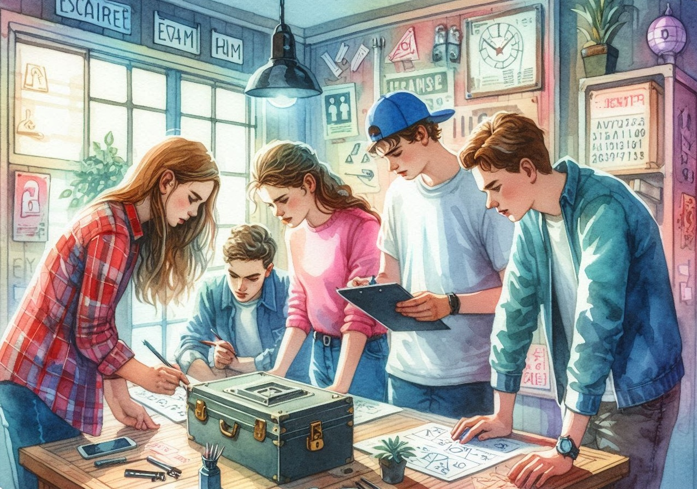
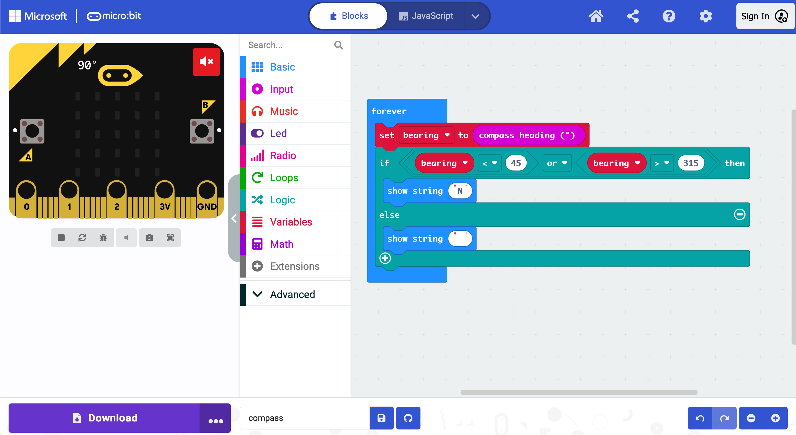
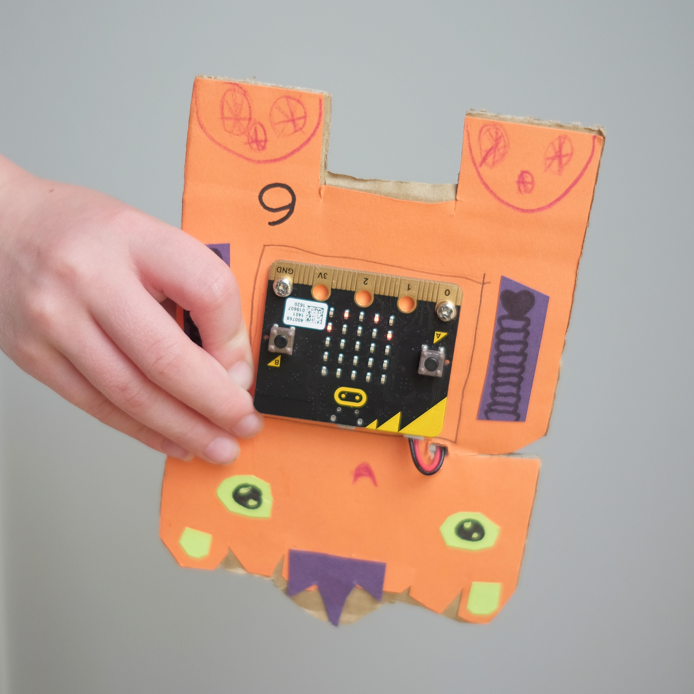
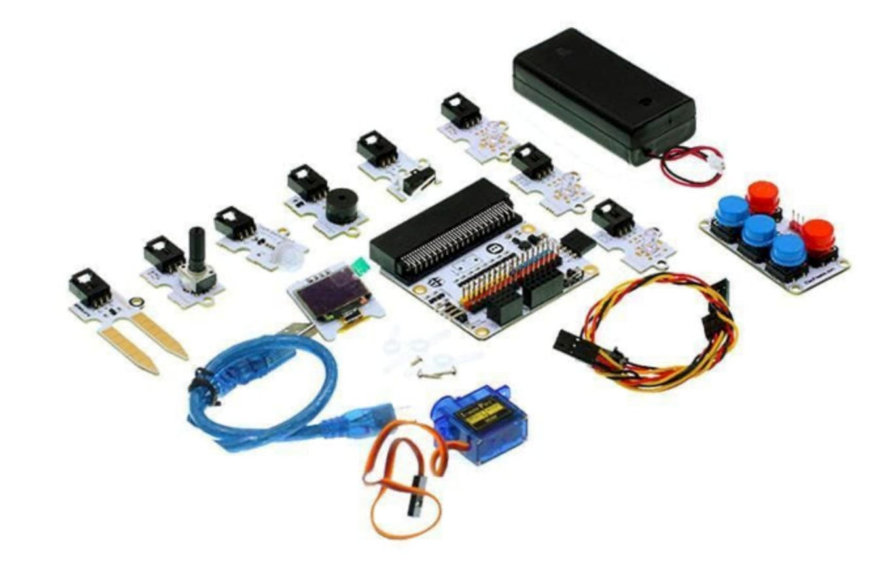
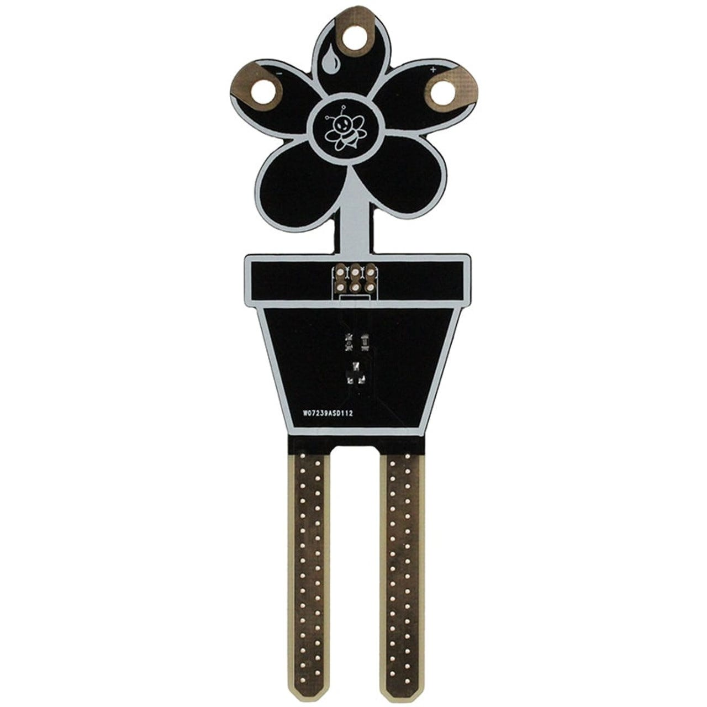
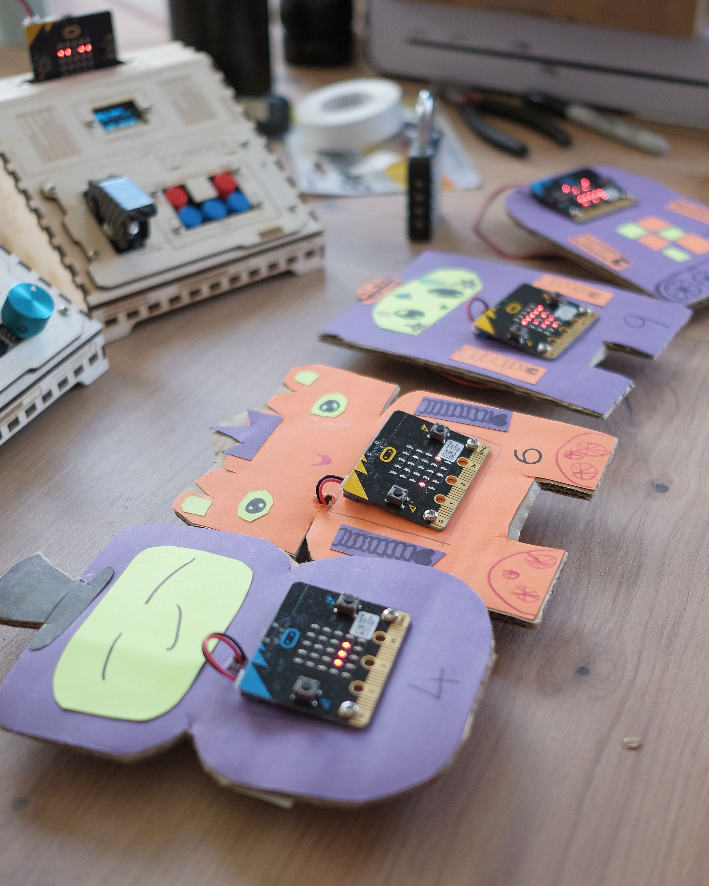
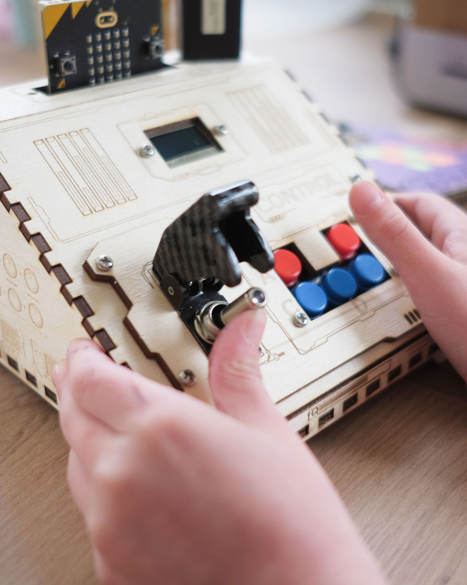

Escape rooms can be great fun for kids and adults alike. In this post, I look at how technology can be used to create puzzles and challenges, and discuss how you can help kids to design and build their own escape room activities using the micro:bit computer. It’s a really practical way for them to learn how technology can be used to build things outside of the computer, as well as giving them opportunities to be creative. When they’ve finished, they can start a competition for their friends to see who can solve the puzzles fastest.

I’ll talk about a step by step approach for kids to follow to design their own escape room challenge, and also include some examples from a micro:bit escape room I recently built & ran for the Scouts & Guides.

## What is an escape room?

Escape rooms are games where a team is locked in a room filled with clues and puzzles. They have to work together to find out what to do, and answer the questions correctly in order to escape. They’re normally against the clock, so teams will want to work as quickly as possible to get the best score.

There are plenty of escape rooms aimed at adults where you’re literally locked in. For activities designed for kids this probably isn’t the best idea, but you can still give them a room full of challenges without the need for an actual lock!

Escape rooms will often have a theme. For example, the activity I built was themed around a crashed space ship. The teams had to interrogate robots, refill the fuel tank and enter the launch sequence to fly back to space HQ and win the game.

Most escape rooms will have lots of puzzles to solve to reach the final goal, and this can take up to an hour. But shorter challenges can work just as well. Kids can get started with just a simple puzzle or two, and still have a lot of fun.

## The micro:bit computer

The micro:bit is a tiny computer, about the size of a bank card. It’s the ideal “brain” to use for this sort of activity as it has plenty of functionality and is very portable, needing just two AAA batteries to run.

Kids can program it easily, using a Scratch like interface or their laptop or PC.

The MakeCode interface for programming the micro:bit

Micro:bits are also really easy to get hold of. Many clubs and schools already have some, thanks to the BBC scheme which sent them out for free. They are also available to borrow for free from many libraries in the UK.

## Step 1 - Design

### Designing the puzzle

The micro:bit has a wide range of features - it can do a surprising amount for such a small board. A good way for kids to start thinking about puzzle ideas is to list these capabilities. Take a look at the [micro:bit website](https://microbit.org/get-started/features/overview/) for a reminder of everything it can do. As they write out the list, kids can think about how each function could be used in a puzzle.

One really useful feature of the micro:bit is the accelerometer, which lets it detect its orientation, motion, or even when it’s been dropped. I used this feature in my escape room, in a puzzle where the teams have to turn one robot upside down, and shake another one to get it to reveal the code for the next level.

A micro:bit robot

A few more ideas:

* They could use the micro:bit’s buttons to input morse code (A for dot, B for dash), and get the micro:bit to make the appropriate noise
* Use the light sensor to only show a clue when the micro:bit is in the dark
* The microphone can detect the level of noise. One step in my escape room requires them to make a lot of noise for five seconds - the kids loved this part!

### Using extra components

The micro:bit can do a lot, but you can also extend it by connecting components like extra buttons, dials, sensors and even small screens.

If you have access to these they make great additions for an escape room, but they’re certainly not essential.

The micro:bit Tinker Kit from [ElecFreaks](https://shop.elecfreaks.com/collections/micro-bit)

### Use the environment

The escape room may be built around a computer, but kids can still combine this with other more traditional types of puzzles and activities.

In my escape room the teams have to get a four digit number from the micro:bit robots, which they then use to unlock a real padlock to find a jug of water which they need for the following step.

Another common escape room trick is to write clues in ink which is only visible with UV light. This gets the kids moving around and searching the whole space - not just sitting at the computer.

## Step 2 - Prototyping

Once your kids have brainstormed lots of puzzle ideas, get them to pick one to prototype. This is an important step as often the hardware doesn’t behave in the way we expect it to! Building a demo with very simple code helps kids test and refine their ideas, adapting their design to how the micro:bit works.

I found this step really useful. For example, I had an idea about using a water sensor to make a puzzle where the kids had to refill a fuel tank. I already had the sensor, but it was designed for monitoring the moisture level in soil for house plants, and I didn’t know if it would work when dipped in a glass of water.

Moisture Sensor for micro:bit

Writing some basic code to see what readings came back from the sensor helped me understand how it really worked, and proved that it would be able to detect the water level - just what I needed for that part of the puzzle.

Get the kids to try out their ideas in a simple form, and ask - does the micro:bit react in the way they thought it would? Do they need to change their plans based on what they’ve learnt?

## Step 3 - Theme and decorations

Now the puzzle is working, it’s time to bring the whole thing to life with some decorations, fitting the theme and story of the escape room.

### Theme 

Picking a theme for the escape room sets the scene for the puzzle and brings it to life. And, if your kids choose to extend the puzzle in the future, it will tie the challenges together and tell a broader story.

Encourage your kids to think about what setting they would like, taking inspiration from their favourite books, TV shows, films, or anything else they find interesting. They can then pick their favourite, thinking about how the chosen puzzle relates to this theme.

For example, I wanted to include a map based puzzle in my room. Thinking about the space theme, I chose to show a map of planets, with a space HQ in the centre.

Another good theme could be a fantasy setting - here the kids could have the micro:bit acting as a magical device.

### Props and decorations

Once they’ve picked a theme, kids can build objects and decorations to bring their puzzles to life. Using cardboard and other everyday crafting items, they can transform the micro:bit into all sorts of objects, fitting into the theme and story of their escape room.

For example, I made a “battery” for one of my puzzles, out of an old Pringles can. Teams had to run around with this to “charge” the battery and power up the ship.

I also made a collection of robots with coloured card and cardboard backing, with a little help from my daughter.

Older kids might like to look at 3D printing, or using a laser cutter (with adult help!) to make enclosures for the micro:bits, like below. These are much more complicated options though, and a cardboard construction works fine if you don’t have access to this sort of thing.

They might also enjoy making other decorations which aren’t part of the puzzle, but help bring the set to life.

## Step 4 - Play Testing

The puzzle is working, and the scene is set - it’s time to play through the puzzle and see how well it works. Kids can do this themselves, and when they think it’s ready you can give it a try as well. Give them some constructive feedback, and encourage them to think about whether the puzzle is too hard, or too easy.

They can then make some final tweaks, before challenging their friends! Use a stop watch to time how quickly people can solve the puzzle, and set up a score board to show who can beat the game in the fastest time.

## Multiple Stages

For a more advanced project, kids can try joining multiple puzzles together into a longer escape room. This works well with the theme, and can tell a story. In my escape room, each stage of the puzzle was a step towards fixing the space ship.

One way of combining puzzles is by using more than one micro:bit, and using the radio feature to communicate between them. For example, completing a puzzle on one micro:bit can then activate the puzzle on the next one.

If you just have the one micro:bit, kids can still chain multiple steps together by either extending the code to have multiple levels, or by combining the micro:bit based puzzle with traditional offline puzzles such as finding a combination to unlock a safe.

## My escape room

If you’d like to find out more about the escape room I built, all of the code, descriptions and designs are shared on the [GitHub](https://github.com/brggs/Fix-The-SpaceShip-Escape-Room) page for the project.

I used Python to code these challenges, and while it’s likely more complicated than anything you’ll make with your kids, it might be helpful to have a look through and see how I built each of the puzzle steps.

Feel free to drop me a message if you’d like any more details about how it works!

## Happy escaping!

I hope this is a useful guide, and you have loads of fun creating escape room challenges & puzzles with your kids.

I’d love to see what they make, so please do tag me on [Instagram](https://www.instagram.com/mrabriggs/) or drop me an email with photos!