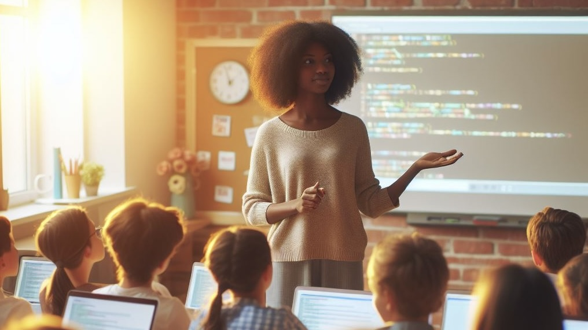
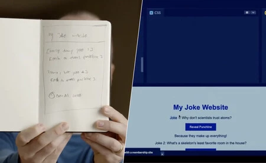

## Why ask this question?

I have built my career around coding and software development, and am a big supporter of getting more kids into the field. I even run a coding club to provide our local kids with the opportunity to learn about and experience coding and technology.

So, why would I question whether it’s still worthwhile teaching kids to code in 2024?

Over the last few years we seen rapid advances in AI technology. Tools such as ChatGPT are now capable of some really impressive stuff. Taking exams, helping translate between languages, writing letters, acting as a travel guide, they can do almost anything we can imagine.

As well as all this, they are also capable of writing code and creating software. Congnition’s [Devin](https://www.cognition-labs.com/introducing-devin) has been shown creating complex software from a simple description. And in a recent demo, OpenAI showed their latest model creating a functional website based solely on a crude sketch:

##### GPT 4 creating a website based on a sketch, as show in the [GPT-4 Developer Livestream](https://www.youtube.com/live/outcGtbnMuQ?si=M7go0_f5PzsdADNj&t=976)

It seems likely that AI will have a big impact on how we create software in the future, but how will the career of computer programming be affected? If AI is able to write computer programs for us, is there any need for our kids to learn to code?

## So, do we still need to learn to code?

While AI is powerful, I’m not convinced that it will remove the need for programmers.

Writing the code is a just one part of software development. Software developers spend a lot of their time solving business problems and coming up with the correct solution, before they then convert that into code. This requires a good understanding of the domain, the real needs of the users as well as good problem solving skills. Once the correct solution has been identified, often writing the code is the easy part.

Without these skills, it doesn’t matter how quickly code can be created. Generating a program in seconds is pointless if it doesn’t do the right thing.

AI may become adept at helping us write code more quickly, but it seems unlikely that it will replace this broader part of the job. Instead it is much more probable that it will become a really effective assistant. Just like how calculators didn’t remove the need to understand mathematical concepts, but they did help us get to the answer more quickly. Developers will still need to understand what they’re doing, but they will be able to use AI to speed things up and handle the boring bits.

We will also still need the skills to review what’s been produced, to make sure it’s actually doing what we asked for, and is secure. To do this properly, we will need people who are able to read and understand the code.

Since the 60s new technologies have repeatedly come along, each of which was said to remove the need for software engineers. This hasn’t happened yet, and probably won’t happen with AI either.

We must teach kids about AI alongside the usual computer science education. This will help prepare the software developers of the future for the new way of working. It will also create a generation with a deeper understanding of AI, to help combat bias and ensure it works to make the world a better place.

## But, what if AI could do everything?

It seems unlikely that AI will be able to replace the broader skills of a software engineer as well as just generating code. But let’s explore for a minute an extreme scenario. What would happen if AI really does becomes so good that we no longer need to handle any aspects of software development ourselves?

We can see a parallel here with art. AI is already at a level where it can produce images of a high quality, certainly far better than what I can do personally.

But, we can’t let AI have all the fun! Just because it could do a better job doesn’t mean we can’t still enjoy the process of creating. If we enjoy something we should continue to pursue it.

And, as a society we should continue to value things which are created by real humans. Things which have a human story behind them, and which required human effort to create. Just as how today we place more value on a home cooked meal, or a hand made piece of furniture.

We have robotic production lines which could make these things, quicker and more efficiently than humans. But it’s just not the same. Even when the output is identical, we should still value and appreciate when someone has put something of themselves into their creation. This elevates the end product in a way that an artificial creation could never replicate.

In this future where the perfect AI exists and is able to do all of the work for us, I still think it’s worth learning to code, just as it’s still worth us learning to create artwork or write poetry. Creating is a fun and fulfilling thing and human existence would be much poorer if we outsource it to machines.

Creation is a noble pursuit, and one we should all aspire to, even if someday we do reach a world where it’s no longer required.

## Conclusion

It looks very likely that AI will have a big impact on coding, providing a powerful assistant to make us all more productive and efficient.

But, it won’t go so far as to remove the need for software engineer - people who can understand the need for the software being created, validate the final product is what’s actually needed, and check that it is secure.

So, in 2024 I think it is still a good idea to learn coding, and to teach our kids this valuable and enjoyable skill. Giving our kids a solid understanding of coding, technology and AI itself will become more important than ever.

Thanks for reading! Do you agree with this view? Get in touch and let me know.