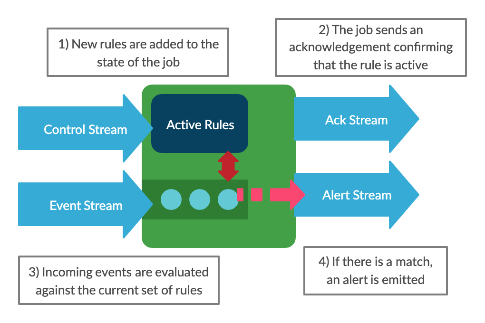

This is part 3 in a series on building a dynamic, rules based streams processing application with [Apache Flink](https://flink.apache.org/).

1. [Introduction](/blog/dynamic-streams-processing-with-apache-flink/)
2. [Rules Based Stream Processing with Apache Flink's Broadcast Pattern](/blog/broadcast-state-pattern-rules-based-flink)
3. Automated Testing of the Broadcast State Pattern

## Overview

In the last post we saw how the Broadcast State Pattern can be used with Apache Flink to create a simple dynamic rules engine.  Instead of hard coding our rules, we added an extra data stream to allow new rules to flow into the system.

In this post we will look at how that application can be tested.  We'll start with a quick discussion of unit testing, which is straight forward, then we'll move onto integration testing, which will require a little more work.

Flink provides a local test cluster to simplify integration testing, allowing the job logic to be exercised without the need for connecting to external systems such as Kafka.  However, using this is made more complicated by the fact that we have two input  streams, so we will write some custom code to handle this scenario and allow us to control the timings of when events and rules enter the system.  This approach works for testing the Broadcast State Pattern, and would also work for any other Flink job where two or more input streams are involved.

Before we move on, here's a quick reminder of how the system works, showing the input streams for events and rules and the output streams for alerts and rule acknowledgements.



## Unit Testing

Unit testing your custom Flink functions is no different to unit testing any other class.  We just need to mock the dependencies, such as the processing context and input/output streams, and we're good to go.  This code uses [Mockito](https://site.mockito.org/) for mocks.

Here's the unit test for our `InputBroadcastProcessFunction`, validating that a new rule is added correctly:

```java
@Test
void newRule_shouldAddRule() throws Exception {

    // Create the test rule to be added
    val ruleId = "ruleId";
    val rule = Rule.builder()
            .condition(new EqualCondition("processName", "process.exe"))
            .build();
    val ruleData = new ObjectMapper().writeValueAsString(rule);

    // Mock the operator state
    BroadcastState<String, Rule> ruleState = Mockito.mock(BroadcastState.class);
    val contextMock = Mockito.mock(InputBroadcastProcessFunction.Context.class);
    Mockito.<BroadcastState<String, Rule>>when(contextMock.getBroadcastState(any())).thenReturn(ruleState);

    // Perform the test
    val testFunction = new InputBroadcastProcessFunction();
    testFunction.processBroadcastElement(new ControlInput(ControlInputType.ADD_RULE, ruleId, 1, ruleData), contextMock, null);

    // Validate that the operator added the rule to the state
    val ruleCaptor = ArgumentCaptor.forClass(Rule.class);
    verify(ruleState, times(1)).put(any(String.class), ruleCaptor.capture());
    val capturedRules = ruleCaptor.getAllValues();
    assertEquals(ruleId, capturedRules.get(0).getId());
}
```

View the [source](https://github.com/brggs/dynamic-flink-part1/blob/master/src/test/java/uk/co/brggs/dynamicflink/InputBroadcastProcessFunctionTest.java) if you'd like to see the other tests for this function.

That's all there is to it, so let's move on to integration testing.

## Integration Testing

Once we have a suite of unit tests, we now want to see whether the job as a whole runs correctly.  Flink provides a [standalone cluster](https://ci.apache.org/projects/flink/flink-docs-release-1.9/dev/stream/testing.html#junit-rule-miniclusterwithclientresource) for running integration tests, which lets us do this without the need to set up external dependencies such as Kafka.

We can use this to write tests where we configure the system with a rule, then check whether an alert is raised when matching events appear in the input stream.

This is where we hit an issue though.  The standard input streams used with the test cluster compete with each other to be first to send their data into the system.  Because of this we get a race condition - sometimes the rules will enter the system before the test events, resulting a successful test, but sometimes the events will get there before the rules, resulting in a failure.

We can fix this by implementing custom source functions.  These let us control the timing of when the data is sent into the system, giving us predictable behaviour and accurate test results.

In our case, we will use custom sources to send all the rule data, then send all the event data.  In order to do this, we need to know when the rules have been processed successfully, and that's where our acknowledgement stream comes in.  Once we've received acks for each of our rules, we know it's time to start the event stream.

Many thanks to Till Rohrmann for suggesting this approach and providing the starting point for the implementation on [Stack Overflow](https://stackoverflow.com/questions/54908476/flink-integration-testing-with-multiple-sources)


### Controllable Source Functions

To create our controllable source function, we create a class which extends `RichParallelSourceFunction<T>`.

This has a constructor which takes a list of the messages we want the source to produce.  Later on we will create two instances of this class, one for rules and one for events.

```java
public class ControllableSourceFunction<T> extends RichParallelSourceFunction<T> {

    private static final ConcurrentMap<String, CountDownLatch> startLatches = new ConcurrentHashMap<>();

    private final String name;
    private final List<T> itemsForOutput;

    private boolean running = true;

    ControllableSourceFunction(String name, List<T> itemsForOutput) {
        this.name = name;
        this.itemsForOutput = itemsForOutput;
    }

```

In the class's `run()` method (which Flink will call when the job starts), we wait on the `CountDownLatch` before sending the items.

```java
    @Override
    public void run(SourceContext<T> sourceContext) throws Exception {
        final int index = getRuntimeContext().getIndexOfThisSubtask();

        final CountDownLatch startLatch = startLatches.computeIfAbsent(getId(index), ignored -> new CountDownLatch(1));

        startLatch.await();
        int counter = 0;

        while (running && counter < itemsForOutput.size()) {
            synchronized (sourceContext.getCheckpointLock()) {
                sourceContext.collect(itemsForOutput.get(counter++));
            }
        }
    }
```

Finally we add `startExecution()` to provide a way for us to tell the source to start sending its messages when we're ready. 

```java
    static void startExecution(ControllableSourceFunction source, int index) {
        final CountDownLatch startLatch = startLatches.computeIfAbsent(source.getId(index), ignored -> new CountDownLatch(1));
        startLatch.countDown();
    }
```

Note the `startLatches` field needs to be static, because these objects will be serialised within the Flink test cluster (mimicking the real action of the system sending the operators out to different Task Managers).  Because everything will be done locally, we can make the fields static to allow the latch instances to be shared.

The full source of the `ControllableSourceFunction` class can be viewed [here](https://github.com/brggs/dynamic-flink-part1/blob/master/src/test/java/uk/co/brggs/dynamicflink/integration/shared/ControllableSourceFunction.java).


### Integration Test Cluster
 
The `IntegrationTestCluster` class is where we will set up and execute the job, using our controllable source functions, and Flink's `MiniClusterWithClientResource`.  We will share an instance of this class between all our test cases, so we can reuse the same cluster to make tests quicker and more efficient.

I won't reproduce the whole class here as it's quite long, instead I'll just draw attention to the key parts.  The full source can be viewed [here](https://github.com/brggs/dynamic-flink-part1/blob/master/src/test/java/uk/co/brggs/dynamicflink/integration/shared/IntegrationTestCluster.java).

Our entry point here will be the `run()` method.  We will call this from each of our integration tests, passing in a list of rules (the `controlInput`) and events.

```java
    public void run(List<ControlInput> controlInput, List<String> events)
``` 

The test results will be exposed via the `EventSink`, which will keep a list of all the alerts (`OutputEvents`) which were received.

```java
    public static class EventSink implements SinkFunction<OutputEvent> {
        public static final List<OutputEvent> values = new ArrayList<>();
    }
```

We'll come back to what this looks like in a test case later, but now let's run through what happens when we call that `run()` method.

Firstly it tidies things up and gets ready for a test run:
1. Clears any output from previous tests
2. Sets up a `StringWriter` to capture the log output
3. Configures the execution environment
4. Creates two instances of `ControllableSourceFunction`, one for events and one for rules (`ControlInput`)

Next we build and submit the job, by calling `DynamicFlink.build()`, then getting the resulting job graph and passing this into the mini cluster.

This step is why we created the `DynamicFlink` class in the previous post.  If we had put the job logic in the main method of the program, it wouldn't be possible to test the job in this way without duplicating the job code.

Now that the job is running, the next steps are:
1. Start the control source, to send the rules into the system 
2. Wait for all rules to be acknowledged
3. Start the event source
4. Wait for the job to complete

After completion, we run a few verification steps.  Our tests will fail if any of the following occurred during the run:
* A rule failed to be added (indicated by a failure code in the acknowledgement)
* The log output indicated that the Flink job failed (possibly due to an unhandled exception)

Specific validation of the alerts that were produced can then be performed by the calling test case.

Before we move on, let's look at the output sinks in more detail.

These are custom `SinkFunction` implementations.  Note the `values` fields allow the output to be inspected following a test run.  As we saw previously, these fields need to be static because the objects will be serialised within the test cluster.  Again, making the fields static ensures everything ends up in the same list.

Let's look at `ControlSink` specifically.  The `CompletableFuture` called `allControlResponsesReceived` allows this sink to send a notification when it has received all the acknowledgements it was expecting.  This is used in the `run()` method to wait for all the rules to be acknowledged before starting the event source.

```java
public static class ControlSink implements SinkFunction<ControlOutput> {
    static final List<ControlOutput> values = new ArrayList<>();
    static CompletableFuture<Void> allControlResponsesReceived = new CompletableFuture<>();

    @Override
    public synchronized void invoke(ControlOutput value, Context ctx) {
        values.add(value);
        if (values.size() == controlCount) {
            allControlResponsesReceived.complete(null);
        }
    }
}
```

### Test Base Class

Now we've gone over the `IntegrationTestCluster` class, we need to make it available to all of our test cases.

This can be done by creating an abstract class, `IntegrationTestBase`, as a base for each of the integration test classes.  This provides a standard way to access the test cluster from each of the test cases, as well as ensuring that only a single instance of the cluster is created, resulting in faster tests.

```java
public abstract class IntegrationTestBase {
    protected static final IntegrationTestCluster testCluster = new IntegrationTestCluster();
}
```

### Integration Test Cases

Finally let's look at an example test case and see how this all comes together.

Note how the test rule is built using the Lombok provided builder methods, and also the use of the `TestEventGenerator` class ([source](https://github.com/brggs/dynamic-flink-part1/blob/master/src/test/java/uk/co/brggs/dynamicflink/TestEventGenerator.java)) to streamline the generation of event JSON.

```java
class SingleEventIntegrationTest extends IntegrationTestBase {

    @Test
    void simpleMatchingCondition_shouldProduceAlert() throws Exception {

        // Create our test rule, which matches when two fields have specific values
        val rule = Rule.builder()
                .condition(
                        new CompositeCondition(
                                CompositeType.AND,
                                Arrays.asList(
                                        new EqualCondition("hostname", "importantLaptop"),
                                        new EqualCondition("destinationIp", "12.23.45.67"))))
                .build();

        // Serialise the test rule, so it can be sent in to the job
        val ruleData = new ObjectMapper().writeValueAsString(rule);
        val controlInput = Collections.singletonList(
                new ControlInput(ControlInputType.ADD_RULE, "matchingRule", 1, ruleData));

        // Helper class to simplify building test event json
        val teg = TestEventGenerator.builder()
                .startTime(Instant.parse("2019-05-21T12:00:00.000Z"))
                .build();
        
        // Set up our input with one matching, and one non-matching event
        val events = Arrays.asList(
                teg.generate("destinationIp", "12.23.45.67", "hostname", "importantLaptop"),
                teg.generate("destinationIp", "12.23.45.67", "hostname", "anotherLaptop"));

        // Run the job
        testCluster.run(controlInput, events);

        // Check that one alert was received
        assertEquals(1, IntegrationTestCluster.EventSink.values.size());

        // Check the rule matched the correct event
        val matchedEvent = IntegrationTestCluster.EventSink.values.get(0);
        assertEquals("matchingRule", matchedEvent.getMatchedRuleId());
        assertEquals(1, matchedEvent.getMatchedRuleVersion());
        assertEquals("2019-05-21T12:00:00.000Z", matchedEvent.getEventTime());
        assertTrue(matchedEvent.getEventContent().contains("importantLaptop"));
    }
}
```

## Summary

In this post we looked at how to write automated tests for a Flink application with two or more input streams, such as those which implement the Broadcast State Pattern.

This is a great starting place for building up a full suite of integration tests, exercising the full logic of the application.

For a production system, of course you'd want to go further than this and create a reference environment to allow end to end testing of the full system, including Kafka.  This would also allow for performance testing and/or verification of the system's security model.
