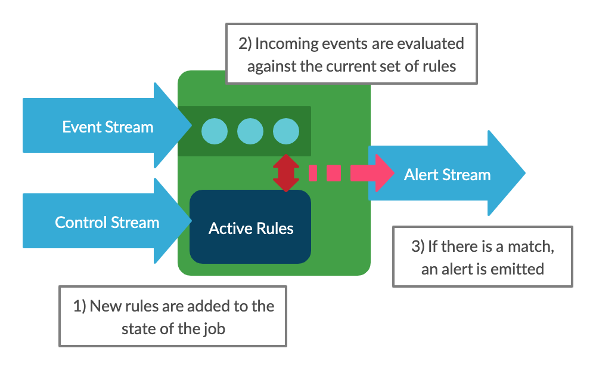
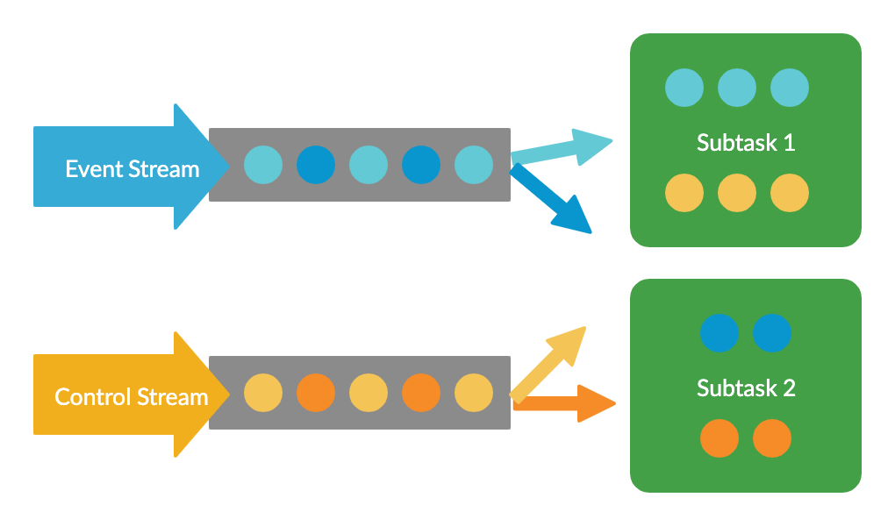
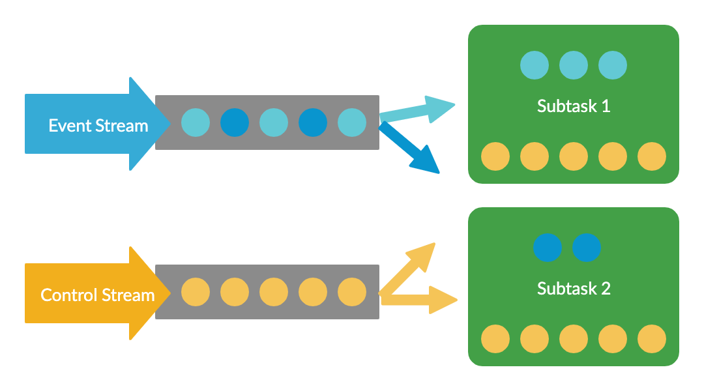

This is part 2 in a series on building a dynamic, rules based streams processing application with [Apache Flink](https://flink.apache.org/).

1. [Introduction](/blog/dynamic-streams-processing-with-apache-flink/)
2. Rules Based Stream Processing with Apache Flink's Broadcast Pattern
3. [Automated Testing of the Broadcast State Pattern](/blog/testing-flink-broadcast-state)

## Background

In this post we will be using the Broadcast State design pattern to build a Flink application which allows us to apply simple rules to a stream of events represented as JSON documents.  This design pattern will allow us to update the rules while the application is running without interrupting processing and without changing the code.

This will be a simplified version of the full system described in the [introduction](/blog/dynamic-streams-processing-with-apache-flink/).

In this version, the rules will simply check the JSON for fields containing specific values.  For example:

```
    Emit an alert when we see an event where "severity" = "high"
```

We'll look at more complex rules such as sequences of events, or detecting changes in the patterns of events in future posts.

It is assumed that you have some basic experience with Flink, and some familiarity with its concepts and DataStream API. If you're brand new to Flink it's probably worth reading some [more basic tutorials](https://ci.apache.org/projects/flink/flink-docs-release-1.9/getting-started/tutorials/datastream_api.html#writing-a-flink-program) before continuing.

This project is implemented in Java, and makes use of [Lombok](https://projectlombok.org/) to provide implicit typing (using `val` and `var`) as well as automating boilerplate code such as getters & setters through the use of annotations.

If you'd rather skip ahead and dive into the source, it can be found [here](https://github.com/brggs/dynamic-flink-part1).

## Rules as a Data Stream

First we'll consider how to make it possible to update the rules applied by the application without interrupting execution.

Let's return to our example rule.  We want to evaluate each incoming JSON document to check whether it has a `severity` field with the value `high`.  If so, we want to output an alert event.

Building this logic in Flink would be really simple, but any time we wanted to update the rule, for example if we wanted to change `high` to `medium`, we'd have to update the code, rebuild the jar and redeploy the job.  This won't work well for our situation, as it will take time to rebuild the jar, and will temporarily interrupt processing when the new job is deployed.

We can solve this problem by thinking of the rules as a separate stream of data.  We can use this second stream (which we'll call the control stream) to send a rule in to the system, where it will be added to the state of the job.  It will then be applied to all the subsequent data coming in on the event stream.



This gives us a system where we can easily change the rule logic, and even have multiple rules in effect at a time.  Let's now look at how we can implement this with Flink.

## The Broadcast State Pattern

Flink supports joining two streams together in a number of ways, but we have to be careful about how we do this.  We could use something like a `CoProcessFunction` to combine the streams, and this would work fine when the job is running with a parallelism of 1.

We'd have a problem when increasing the parallelism however.  Flink would spread the data from each stream out across all the instances of the subtask.  This is exactly what we want for the event data (so we can handle higher volumes) but it's definitely not what we want for our rules.  Spreading these out would result in different subsets of our rules being applied to the data stream at each instance, as the diagram shows:  



We want all of the rules to be applied to all of the events, and that's where the Broadcast State Pattern comes in.

This is a design pattern for Flink applications, which lets us broadcast one stream of data to all nodes, while splitting another in the normal way.  The data which is broadcast can then be stored in the operator's state.  Note that this state must take the form of a map.  In our case, this will be a map from the rule ID (a string) to the rule data itself.

This provides the perfect solution to our problem.  Our event data can be split up and analysed in a distributed manner, but the same set of rules will be applied regardless of where the event is processed.



## Implementing the pattern

To implement the Broadcast State pattern, we must extend the `BroadcastProcessFunction` class.  This will join our two streams together, keep the rules in its state, and will also be responsible for comparing each incoming event for a match.

In this class, we override two methods, one for the incoming rules: `processBroadcastElement()`, and one for the incoming events: `processElement()`.

We also have a member variable which describes the data which is to be saved in the operator state.  As mentioned previously, this has to be a `MapStateDescriptor`.  Our key is the rule ID, which will be a string which uniquely identifies the rule, and the value is a POJO containing the rule definition.

```java
public class InputBroadcastProcessFunction
        extends BroadcastProcessFunction<String, ControlInput, OutputEvent> {

    private final MapStateDescriptor<String, Rule> ruleStateDescriptor = new MapStateDescriptor<>(
            "RulesBroadcastState",
            Types.STRING,
            Types.POJO(Rule.class));

    @Override
    public void processBroadcastElement(ControlInput controlInput, Context ctx, Collector<OutputEvent> collector) {
        /* Add the rule to our state, and return an acknowledgement. */
    }

    @Override
    public void processElement(String eventContent, ReadOnlyContext ctx, Collector<OutputEvent> collector) {
        /* Check the input against the rules, and emit an alert  */
    }
}
```

### Adding rules

In `processBroadcastElement()`, we validate then store our new rule.  We will also create an acknowledgement, which will let us send confirmation that the rule was successfully added.

We are using the `ControlInput` class ([view source](https://github.com/brggs/dynamic-flink-part1/blob/master/src/main/java/uk/co/brggs/dynamicflink/control/ControlInput.java)) for the input here, this is a POJO containing metadata and a string containing the serialised rule definition.  

First we read data from the input:

```java
    val ruleId = controlInput.getRuleId();
    val ruleVersion = controlInput.getRuleVersion();
    val content = controlInput.getContent();
```

Next we need to get the current state (which is our list of active rules).  We can access this using our state descriptor and the `Context` instance which was passed to this method as the `ctx` parameter:

```java
    val rules = ctx.getBroadcastState(ruleStateDescriptor);
```

We then check to see whether the rule already exists in the state, and if so whether the rule we've received is a newer version.  Older versions are rejected, as we don't want to load a outdated data.

```java
    if (rules.contains(ruleId) && rules.get(ruleId).getVersion() >= ruleVersion) {
        log.info("Rule {}, version {} already present. No action taken.", ruleId, rules.get(ruleId).getVersion());
    }
```

If the rule is a new version, we deserialise it and add it to our state.  We also copy the rule ID and version into our rule object to ensure these are consistent with the values in the control input.

```java
    else {
        val newRule = new ObjectMapper().readValue(content, Rule.class);
        newRule.setId(ruleId);
        newRule.setVersion(ruleVersion);
        rules.put(ruleId, newRule);
    }
```

The `Rule` class contains a condition field which determines which events it will match.  This is an interface with a single method: `checkMatch()`.  There are a number of implementations for this, allowing us to check a field in the event data for:
* a specific value
* a numeric value less than/greater than a specified limit
* a value matching a regex
* a combination of the previous conditions, using boolean logic

These are very simple, so we won't go into any more detail, but the implementations can be found [here](https://github.com/brggs/dynamic-flink-part1/tree/master/src/main/java/uk/co/brggs/dynamicflink/blocks/conditions).

Finally, we need to send an acknowledgement so we know the rule has been received.  The system would work without this, but it's useful for dealing with errors, and is particularly helpful for debugging and testing.

The `BroadcastProcessFunction` has only one normal output, which we need to use for our alerts.  So, in order to output our acknowledgements as well, we need to use Flink's [side output](https://ci.apache.org/projects/flink/flink-docs-stable/dev/stream/side_output.html) feature.

We can access this and send our acknowledgement via the `Context` like so:

```java
    val output = new ControlOutput(controlInput, ControlOutputStatus.RULE_ACTIVE);
    ctx.output(ControlOutputTag.controlOutput, output);
```

### Processing Events

The second method we need to override for our `BroadcastProcessFunction` is `processElement()`, which evaluates each incoming event against our rules and creates an alert whenever there is a match.

We receive the event here as a JSON string, so the first thing to do is wrap it in our `InputEvent` class ([view source](https://github.com/brggs/dynamic-flink-part1/blob/master/src/main/java/uk/co/brggs/dynamicflink/events/InputEvent.java)).  This provides a way to lazily load the event content, and takes care of caching any values which are read.

```java
    val inputEvent = new InputEvent(eventContent);
```

Then we get the list of rules from the operator state (note that this list is read only in this method, the state can only be updated in `processBroadcastElement()`).  We then go through the list, checking each rules condition to see if it matches the event, using the `checkMatch()` method.

If there is a match, we create an instance of the `OutputEvent` class ([view source](https://github.com/brggs/dynamic-flink-part1/blob/master/src/main/java/uk/co/brggs/dynamicflink/control/ControlOutput.java)) to hold the details and send it to the output `collector`.

```java
    ctx.getBroadcastState(ruleStateDescriptor).immutableEntries().forEach(ruleEntry -> {
        val rule = ruleEntry.getValue();

        if (rule.getCondition().checkMatch(inputEvent)) {
            val outputEvent = OutputEvent.builder()
                    .matchedRuleId(rule.getId())
                    .matchedRuleVersion(rule.getVersion())
                    .matchedTime(DateFormatter.getInstance().format(new Date(System.currentTimeMillis())))
                    .eventTime(DateFormatter.getInstance().format(ctx.timestamp()))
                    .eventContent(inputEvent.getContent())
                    .build();

            collector.collect(outputEvent);
        }
    });
```
That completes the implementation of our `BroadcastProcessFunction` class.  To see the full version, complete with error handling, view the source [here](https://github.com/brggs/dynamic-flink-part1/blob/master/src/main/java/uk/co/brggs/dynamicflink/InputBroadcastProcessFunction.java).

## The Flink Job

Now we need to make use of our function as part of a Flink program.

Let's create our `StreamingJob` class with the program's entry point.  We will create our input/output streams here, but in order to make testing easier we will pass these into a separate class, `DynamicFlink`, where we'll wire up the job logic.

Our job looks like this (connector code has been omitted for brevity). See [here](https://github.com/brggs/dynamic-flink-part1/blob/master/src/main/java/uk/co/brggs/dynamicflink/StreamingJob.java) for the full class.

```java
public class StreamingJob {
    public static void main(String[] args) throws Exception {
        val env = StreamExecutionEnvironment.getExecutionEnvironment();
        env.setStreamTimeCharacteristic(TimeCharacteristic.EventTime);

        // ... Create input/output streams ...

        DynamicFlink.build(inputStream, controlStream, outputStream, controlOutput);
        env.execute(StreamingJob.class.getPackage().getName());
    }
}
```

Note the call to `env.setStreamTimeCharacteristic()`, which tells Flink that we want to run in [Event Time mode](https://ci.apache.org/projects/flink/flink-docs-stable/dev/event_time.html).

Within the `DynamicFlink.build()` method, the first thing we do is tell Flink how to extract the timestamp from our events:

```java
    val timestampedEventStream = eventStream.assignTimestampsAndWatermarks(
        new EventTimestampExtractor(Time.seconds(10)));
```

We're providing a [custom class](https://github.com/brggs/dynamic-flink-part1/blob/master/src/main/java/uk/co/brggs/dynamicflink/events/EventTimestampExtractor.java) to do the work here, which simply reads the timestamp from an element in the JSON.  We pass in a parameter indicating that we're willing to accept events up to 10 seconds late.

We are now ready to join the streams with our `InputBroadcastFunction`, but in order to do this we have to tell Flink the format of the data which will be stored in the broadcast state.  This is our rules map, so the descriptor is the same as the one we created previously:

```java
    val controlInputStateDescriptor = new MapStateDescriptor<>(
            "RulesBroadcastState",
            Types.STRING,
            Types.POJO(Rule.class));
``` 

Now we take our control stream, and call `broadcast()`, passing in this descriptor.

```java
    val controlBroadcastStream = controlStream
            .assignTimestampsAndWatermarks(new ControlInputWatermarkAssigner())
            .broadcast(controlInputStateDescriptor);
```

Note that in event time mode, both input streams need to have timestamps assigned.  However, in this situation we want to allow only the event stream to control the progression of time.  This will become important when we implement more advanced rules in later posts, which make use of windows to count events within a specific interval.

We can tell Flink that the flow of time should be controlled by the event stream and not the control stream, by using a custom assigner which always returns `MAX_WATERMARK` for the watermark value on the control stream.  The code for this can be [seen here](https://github.com/brggs/dynamic-flink-part1/blob/master/src/main/java/uk/co/brggs/dynamicflink/control/ControlInputWatermarkAssigner.java).

Now it's time to send both streams into our `InputBroadcastFunction`.

```java
    val processFunctionOutput = timestampedEventStream
            .connect(controlBroadcastStream)
            .process(new InputBroadcastProcessFunction());
```

Finally, we connect our control output to the side output, and the event sink to the main output of `InputBroadcastFunction`.

```java
    processFunctionOutput
            .getSideOutput(ControlOutputTag.controlOutput)
            .addSink(controlOutput);

    processFunctionOutput.addSink(outputEventSink);
```

The complete code for this class can be [found here](https://github.com/brggs/dynamic-flink-part1/blob/master/src/main/java/uk/co/brggs/dynamicflink/DynamicFlink.java.)

## Summary

The simple version of the job is now complete.  We have a system that evaluates events again a set of rules, which can be updated without interrupting processing.

However, we don't have a very easy way of sending rules into the job.  We'll look at creating a component to do this in a later post, but wouldn't it be nice to know whether this works without having to use it part of a larger system?

In the next post, we'll look at how we can write a suite of automated tests for the program, including unit tests and an integration test harness which will run the job in the local Flink test cluster.

### Further Links
The full source code for this version of the project can be found [here](https://github.com/brggs/dynamic-flink-part1).

 For more info on the Broadcast State Pattern:
 * [Flink Documentation](https://ci.apache.org/projects/flink/flink-docs-stable/dev/stream/state/broadcast_state.html)
 * [Broadcast State Pattern in Apache Flink: 4 important considerations](https://www.ververica.com/blog/broadcast-state-pattern-flink-considerations)
