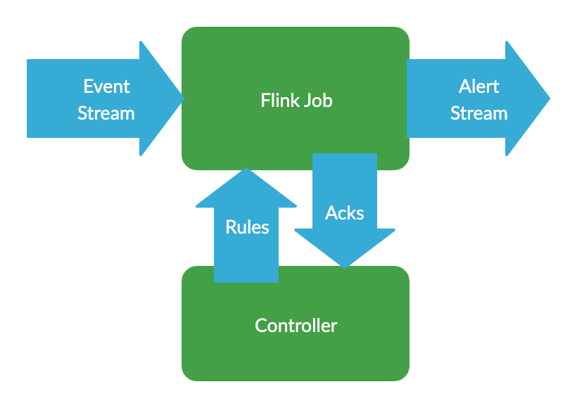

This is part 1 in a series on building a dynamic, rules-based streams processing application with [Apache Flink](https://flink.apache.org/).

1. Introduction
2. [Rules Based Stream Processing with Apache Flink's Broadcast Pattern](/blog/broadcast-state-pattern-rules-based-flink)
3. [Automated Testing of the Broadcast State Pattern](/blog/testing-flink-broadcast-state)

## What & Why

Over the next few blog posts, I'm going to run through the process of building an application which processes a continuous stream of data, comparing it against a set of rules.  If any of the rules match, an alert is created to let us know.  These rules will be dynamic, so it will be possible to update them without interrupting the operation of the system.  We will be building the application using the open source Apache Flink framework, so it will be scalable to millions of events per second.

This is based on an application I designed and built (alongside [Jack](https://github.com/jacktuck)) for a company which is sadly no longer around.  I hope instead the knowledge I gained from the process will be of use to anyone else looking to build something similar.

While the system was originally designed as a network security monitoring system.  The concepts are very generic however, and the application would work well for any situation where you want to analyse a large amount of data in real time and get output when certain conditions occur.

We'll be implementing the following types of rules, which will produce an alert when:
 
* An event with a specific value is seen
* _n_ matching events are seen
* The count of matching events increases significantly from the rolling average
* The count of matching events drops to zero
* A specific pattern of events is seen

## What is Flink?

Flink is a distributed data processing framework, similar to Storm or Spark.  It allows you to write a Java (or Scala) application describing how you want to process your data, and then takes care of scaling out across a cluster, handling state, providing checkpoints for recovery and much more.  

See [the Flink website](https://flink.apache.org/flink-architecture.html) for a comprehensive explanation.

Flink is open source, and available for use under the ASL 2.0 Licence.  The founders and development team were acquired by Alibaba back at the start of 2019, but they and their new owners remain committed to its development, releasing frequent updates.  They're also very active in the developer community, and are very helpful on StackOverflow.

Many companies are using Flink, such as Netflix, Uber, eBay and [many more](https://flink.apache.org/poweredby.html).

If you've never come across Flink before, it's worth brushing up on the basics before continuing with these posts.  See [this tutorial](https://ci.apache.org/projects/flink/flink-docs-release-1.9/getting-started/tutorials/datastream_api.html#writing-a-flink-program) for an introduction.

## Architecture



We will be writing a Flink Job, which will read events in JSON format from a Kafka topic.  If any of the events match, an alert will be sent to another kafka topic.

It would be trivial to swap out the use of Kafka for Kinesis, or any of Flink's other [connectors](https://ci.apache.org/projects/flink/flink-docs-stable/dev/connectors/).  It would also be very simple to alter the system to process data in a format other than JSON.

We will also be writing a controller application, which will handle adding and managing the rules running within the Flink job.

## Lombok

This project is written in Java.  Because Flink requires Java 8, we used [Lombok](https://projectlombok.org/) to make this a more pleasant experience.

Lombok automates large amounts of the boilerplate code often required by Java, as well as providing implicit typing with `val` and `var`.

As an example, the following is all you need to  create a POJO class with getters, setters, a builder and constructors:

```java
    @Data
    @Builder
    @NoArgsConstructor
    @AllArgsConstructor
    public class Rule {
        private String id;
        private int version;
        private Condition condition;
    }
```

## Source

All of the source code discussed in this series is available [on github](https://github.com/brggs/dynamic-flink).

## Part 2

In [part 2](/blog/broadcast-state-pattern-rules-based-flink/), we look at a simple implementation of the rules engine, allowing us to dynamically apply simple matching rules.

If you find these posts, or the project useful please let me know!
